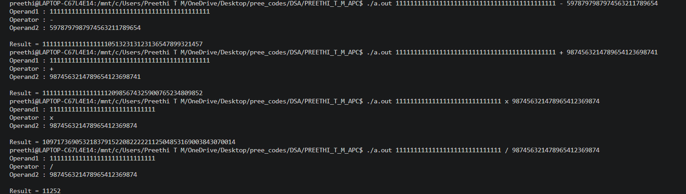

# Arbitrary Precision Calculator

## 📌 Project Overview

The Arbitrary Precision Calculator is a C-based application that performs arithmetic operations on integers of unlimited size, overcoming the limitations of built-in data types. It uses linked lists to represent large numbers, enabling accurate computation of values that exceed the range of standard integer types.

## ✨ Features

- Addition of large integers
- Subtraction of large integers
- Multiplication of large integers
- Division of large integers
- Supports numbers of virtually unlimited length
- Handles positive and negative integers
- Efficient digit-by-digit arithmetic using linked lists
- Menu-driven command-line interface

## 🛠 Technologies Used

- C Programming
- GCC Compiler
- Makefile
- Linked Lists
- Abstract Data Types (ADT)
- Dynamic Memory Allocation
- Modular Programming
- Linux / Git Bash

## 📂 Project Structure

```
ARBITRARY_PRECISION_CALCULATOR
├── Source Files (*.c)
├── Header Files (*.h)
├── Makefile
├── README.md
└── screenshots/
```

> **Note:** File names may vary slightly depending on your implementation.


## 📷 Sample Output

The following screenshot demonstrates arithmetic operations on large integers using the Arbitrary Precision Calculator.



## ▶️ How to Compile

```bash
make
```

## ▶️ How to Run

Execute the program by passing two operands and an arithmetic operator as command-line arguments.

```bash
./a.out <operand1> <operator> <operand2>
```

### Supported Operators

- `+` Addition
- `-` Subtraction
- `x` Multiplication
- `/` Division

## 📷 Sample Usage

```bash
./a.out 987654321987654321987654321 + 123456789123456789123456789
```

## 📷 Example Result

```
Operand1 : 987654321987654321987654321
Operator : +
Operand2 : 123456789123456789123456789

Result:
1111111111111111111111111110
```

## 🎯 Learning Outcomes

- Implementation of arbitrary precision arithmetic
- Linked list manipulation
- Dynamic memory management
- Modular programming in C
- Algorithm design for large integer operations
- Efficient handling of numbers beyond built-in data type limits
